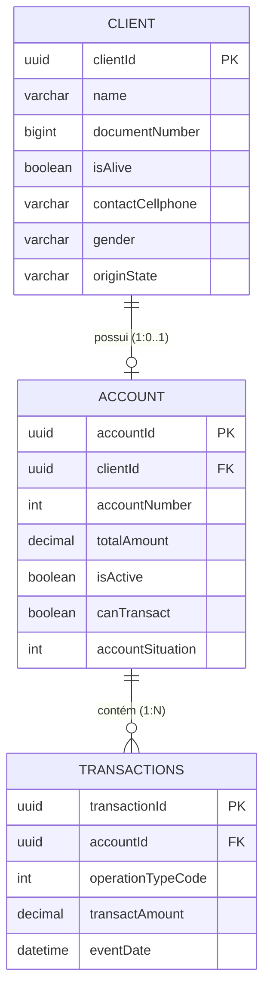

# Pismo Challenge

Esta é uma aplicação de gerenciamento de transações financeiras e contas de clientes desenvolvida em Java 25 utilizando Spring Boot.

---

## 📋 Análise de Requisitos vs. Implementação

O projeto atende a todos os requisitos e regras de negócio especificados:

1. **Titular e Conta (`Cardholder` e `Account`)**:
   - Cada cliente cadastrado (`Client`) pode possuir uma conta associada (`Account`) contendo seu número de conta e saldo consolidado (`totalAmount`).

2. **Transações associadas**:
   - Cada transação financeira executada é registrada na tabela `transactions` com seu respectivo `accountId` correspondente.

3. **Tipos de Operação**:
   - As transações aceitam 4 tipos de operações específicas (mapeadas em `OperationType`):
     1. **NORMAL_PURCHASE** (Compra a Vista)
     2. **PURCHASE_WITH_INSTALLMENTS** (Compra Parcelada)
     3. **WITHDRAWAL** (Saque)
     4. **CREDIT_VOUCHER** (Voucher de Crédito / Pagamento)

4. **Sinal dos Valores Monetários**:
   - Operações de compras e saques (tipos 1, 2 e 3) são validadas e registradas obrigatoriamente com **valores negativos**.
   - Operações de pagamento (tipo 4) são validadas e registradas obrigatoriamente com **valores positivos**.
   - Os valores monetários são geridos utilizando `BigDecimal`, eliminando imprecisões de arredondamento inerentes a tipos de ponto flutuante.

---

## 🗄️ Modelagem e Organização do Banco de Dados

A base de dados é composta por 3 tabelas principais gerenciadas pelo JPA/Hibernate. Abaixo está a representação conceitual do relacionamento entre as tabelas e os tipos de dados mapeados.

### Diagrama de Entidade-Relacionamento (ER)



### Detalhes das Tabelas e Mapeamento

#### 1. Tabela `client`
Guarda as informações cadastrais dos clientes titulares de contas.
* `clientId`: Identificador único (UUID, mapeado como `CHAR(36)` no MySQL).
* `name`: Nome do cliente (`VARCHAR(255)`).
* `documentNumber`: CPF normalizado contendo apenas números (`BIGINT`).
* `isAlive`: Status de sobrevivência do cliente (`BIT(1)`, padrão `true`).
* `contactCellphone`: Celular de contato (`VARCHAR(255)`).
* `gender`: Gênero (`VARCHAR(255)`).
* `originState`: Estado de origem (`VARCHAR(255)`).

#### 2. Tabela `account`
Armazena a conta de transações do cliente.
* `accountId`: Identificador único da conta (UUID, `CHAR(36)`).
* `clientId`: ID do cliente associado (UUID, `CHAR(36)`).
* `accountNumber`: Número da conta gerado aleatoriamente (`INT`).
* `totalAmount`: Saldo monetário atual da conta (`DECIMAL(38,2)`).
* `isActive`: Indica se a conta está ativa (`BIT(1)`, padrão `true`).
* `canTransact`: Indica se a conta está apta a transacionar (`BIT(1)`, padrão `true`).
* `accountSituation`: Código de situação da conta (`INT`), onde `0` representa sem pendências e `1` com pendências (saldo negativo).

#### 3. Tabela `transactions`
Registra cada movimentação financeira realizada.
* `transactionId`: Identificador único da transação (UUID, `CHAR(36)`).
* `accountId`: ID da conta onde a transação foi realizada (UUID, `CHAR(36)`).
* `operationTypeCode`: Tipo de operação (`INT`), mapeando os códigos de 1 a 4.
* `transactAmount`: Valor da transação (`DECIMAL(38,2)`), sendo negativo para saídas (compras/saques) e positivo para entradas (voucher de crédito).
* `eventDate`: Data e hora da ocorrência (`DATETIME(6)`).

---

## 🛠️ Como Executar a Aplicação

Você pode rodar a aplicação localmente utilizando o Maven ou através do Docker Compose.

### Opção 1: Execução Local com Maven
Para compilar e iniciar o projeto localmente (requer JDK 25 e MySQL rodando localmente):
1. Crie o arquivo `.env` a partir do modelo [.env.example](file:///home/vinicius/Downloads/pismo_challenge/.env.example) e preencha a variável `DB_PASSWORD` com a senha do seu banco de dados local.
2. Exporte a variável ou execute os comandos passando-a:
```bash
export DB_PASSWORD=sua_senha
./mvnw clean compile
./mvnw spring-boot:run
```

### Opção 2: Execução com Docker Compose (Recomendado)
Para rodar a aplicação e o banco de dados MySQL de forma totalmente isolada em containers Docker, você **deve configurar o arquivo `.env`**:

1. Copie o arquivo de exemplo [.env.example](file:///home/vinicius/Downloads/pismo_challenge/.env.example) para criar o arquivo `.env`:
   ```bash
   cp .env.example .env
   ```
2. Abra o arquivo `.env` e configure a variável `DB_PASSWORD` com a senha desejada para o banco de dados.

3. Com o arquivo `.env` devidamente configurado, execute o comando abaixo para iniciar os containers:
   ```bash
   docker compose up --build
   ```
*Após a inicialização do container do banco, a aplicação executará a migração automática das tabelas e estará pronta para receber requisições.*

### Opção 3: Executando os Testes Unitários
Para rodar toda a suite de testes unitários desenvolvida (JUnit 5 + Mockito) localmente:
```bash
./mvnw test
```
acesse http://localhost:8080/swagger-ui.html
---

## 📍 Endpoints da API

Abaixo estão listados os endpoints disponíveis na aplicação, acompanhados de exemplos de requisições (`Request`) e respostas (`Response`):

### 1. Clientes (`Client`)
* **Registrar Cliente**
  - **URL:** `POST /client/register-client`
  - **Corpo da Requisição (JSON):**
    ```json
    {
      "name": "João da Silva",
      "documentNumber": "123.456.789-00",
      "contactCellphone": "11999999999",
      "gender": "Masculino",
      "originState": "SP"
    }
    ```
  - **Corpo da Resposta (JSON - 201 Created):**
    ```json
    {
      "clientId": "a4b2c1d3-4567-abcd-ef01-23456789abcd"
    }
    ```

* **Atualizar Situação de Vida** (Se alterado para falecido, congela as contas do cliente)
  - **URL:** `PUT /client/client-life-situation`
  - **Corpo da Requisição (JSON):**
    ```json
    {
      "documentNumber": "123.456.789-00",
      "isAlive": false
    }
    ```
  - **Corpo da Resposta (JSON - 200 OK):**
    ```json
    {
      "clientId": "a4b2c1d3-4567-abcd-ef01-23456789abcd",
      "isAlive": false
    }
    ```

### 2. Contas (`Account`)
* **Criar Conta**
  - **URL:** `POST /accounts`
  - **Corpo da Requisição (JSON):**
    ```json
    {
      "documentNumber": "123.456.789-00"
    }
    ```
  - **Corpo da Resposta (JSON - 201 Created):**
    ```json
    {
      "accountId": "f8c3de45-789a-bcde-f012-3456789abcde"
    }
    ```

* **Consultar Conta**
  - **URL:** `GET /accounts/{accountId}`
  - **Exemplo de URL:** `GET /accounts/f8c3de45-789a-bcde-f012-3456789abcde`
  - **Corpo da Resposta (JSON - 200 OK):**
    ```json
    {
      "accountId": "f8c3de45-789a-bcde-f012-3456789abcde",
      "documentNumber": 12345678900
    }
    ```

### 3. Transações (`Transaction`)
* **Registrar Transação**
  - **URL:** `POST /transactions`
  - **Corpo da Requisição (JSON):**
    ```json
    {
      "accountId": "f8c3de45-789a-bcde-f012-3456789abcde",
      "operationTypeCode": 1,
      "amount": -100.50
    }
    ```
    *(Atenção: `amount` deve ser negativo para compras/saques [1, 2, 3] e positivo para voucher de crédito [4])*
  - **Corpo da Resposta (JSON - 201 Created):**
    ```json
    {
      "transactionId": "9e8d7c6b-5a4f-3e2d-1c0b-9a8f7e6d5c4b"
    }
    ```

---

## 🏛️ Organização da Arquitetura do Projeto

O projeto adota uma arquitetura estruturada em camadas bem definidas para separação de responsabilidades:

```
src/main/java/com/example/pismo_challenge/
│
├── Controller/             # Controladores REST: expõem os endpoints e validam entradas
├── DTO/                    # Data Transfer Objects: estruturas de payload para Input/Output
│   ├── Account/
│   ├── Client/
│   └── Transaction/
│
├── Entity/                 # Entidades e constantes do domínio
│   ├── Model/              # Entidades mapeadas para o banco de dados (JPA)
│   ├── Enum/               # Enums com códigos e situações de negócio
│   └── Event/              # Classes de eventos (records) utilizados para comunicação síncrona entre serviços
│
├── Repository/             # Interfaces de acesso ao banco (Spring Data JPA)
├── Service/                # Camada de lógica de negócio e processamento principal
└── Exception/              # Classes de tratamento global de exceções da API
```

---

## 🔄 Arquitetura Orientada a Eventos (Local Event-Driven)

Para desacoplar as responsabilidades e garantir a atomicidade das transações do banco, foi implementado um mecanismo de eventos síncronos locais utilizando o **`ApplicationEventPublisher`** do Spring Boot e escutadores anotados com **`@TransactionalEventListener`**.

Abaixo estão os fluxos de eventos detalhados por etapas.

---

### 1. Evento de Transação Criada (`TransactionCreatedEvent`)

Quando uma nova transação é registrada com sucesso na camada `TransactionService`, um evento contendo o ID da conta e o valor da transação é disparado de forma síncrona.

#### Sequência de Eventos do Fluxo:

* **Início da Transação (`@Transactional`)**: O cliente envia uma requisição `POST /transactions` para o [TransactionController](file:///home/vinicius/Downloads/pismo_challenge/src/main/java/com/example/pismo_challenge/Controller/TransactionController.java) que aciona o [TransactionService](file:///home/vinicius/Downloads/pismo_challenge/src/main/java/com/example/pismo_challenge/Service/TransactionService.java).
* **Etapa 1: Persistência da Transação**: O [TransactionService](file:///home/vinicius/Downloads/pismo_challenge/src/main/java/com/example/pismo_challenge/Service/TransactionService.java) realiza a validação da transação e a persiste no banco de dados.
* **Etapa 2: Publicação do Evento**: O [TransactionService](file:///home/vinicius/Downloads/pismo_challenge/src/main/java/com/example/pismo_challenge/Service/TransactionService.java) publica o evento `TransactionCreatedEvent` por meio do `ApplicationEventPublisher`.
* **Etapa 3: Atualização do Saldo da Conta (`BEFORE_COMMIT`)**:
  * O [AccountService](file:///home/vinicius/Downloads/pismo_challenge/src/main/java/com/example/pismo_challenge/Service/AccountService.java) intercepta o `TransactionCreatedEvent` de forma síncrona.
  * Busca a conta (`Account`) associada à transação no banco de dados.
  * Adiciona o valor da transação ao saldo total (`totalAmount`) da conta.
  * Atualiza a situação da conta (definindo como pendente caso o saldo fique negativo).
  * Salva a conta atualizada no banco de dados.
* **Retorno e Resposta**: O fluxo retorna ao [TransactionController](file:///home/vinicius/Downloads/pismo_challenge/src/main/java/com/example/pismo_challenge/Controller/TransactionController.java), finalizando a transação do banco de dados e devolvendo a resposta `201 Created` para o cliente.

* **Comportamento:** O escutador em `AccountService` recebe o evento, adiciona o valor da transação ao saldo existente da conta (`totalAmount`) e altera a situação da conta para `ACCOUNT_WITH_PENDING` (código de pendência) se o saldo final for menor que zero.

---

### 2. Evento de Óbito do Cliente (`ClientDiedEvent`)

Se a situação de vida de um cliente é atualizada para falecido (`isAlive = false`) na camada `ClientService`, um evento `ClientDiedEvent` é publicado de forma síncrona para congelar a conta do cliente.

#### Sequência de Eventos do Fluxo:

* **Início da Transação (`@Transactional`)**: O administrador envia uma requisição `PUT /client/client-life-situation` para o [ClientController](file:///home/vinicius/Downloads/pismo_challenge/src/main/java/com/example/pismo_challenge/Controller/ClientController.java) que aciona o [ClientService](file:///home/vinicius/Downloads/pismo_challenge/src/main/java/com/example/pismo_challenge/Service/ClientService.java).
* **Etapa 1: Atualização do Status do Cliente**: O [ClientService](file:///home/vinicius/Downloads/pismo_challenge/src/main/java/com/example/pismo_challenge/Service/ClientService.java) busca o cliente no banco de dados, define `isAlive = false` e salva a alteração.
* **Etapa 2: Publicação do Evento**: O [ClientService](file:///home/vinicius/Downloads/pismo_challenge/src/main/java/com/example/pismo_challenge/Service/ClientService.java) publica o evento `ClientDiedEvent` por meio do `ApplicationEventPublisher`.
* **Etapa 3: Congelamento da Conta (`BEFORE_COMMIT`)**:
  * O [AccountService](file:///home/vinicius/Downloads/pismo_challenge/src/main/java/com/example/pismo_challenge/Service/AccountService.java) intercepta o `ClientDiedEvent` de forma síncrona.
  * Busca a conta (`Account`) correspondente ao cliente associado.
  * Define os atributos da conta `isActive = false` e `canTransact = false`.
  * Salva a conta congelada no banco de dados.
* **Retorno e Resposta**: O fluxo retorna ao [ClientController](file:///home/vinicius/Downloads/pismo_challenge/src/main/java/com/example/pismo_challenge/Controller/ClientController.java), finalizando a transação do banco de dados e devolvendo a resposta `200 OK` para o administrador.

* **Comportamento:** O `AccountService` escuta o evento de óbito e congela imediatamente a conta associada ao cliente (`isActive = false` e `canTransact = false`), impossibilitando novas movimentações de forma automática e segura.

---

### Por que usar `@TransactionalEventListener`?
O uso do `@TransactionalEventListener(phase = TransactionPhase.BEFORE_COMMIT)` garante que os efeitos colaterais dos eventos (como atualizar o saldo ou congelar a conta) rodem e sejam persistidos dentro da **mesma transação de banco de dados** antes que a transação original seja confirmada (commitada), mantendo a integridade transacional dos dados intacta.
